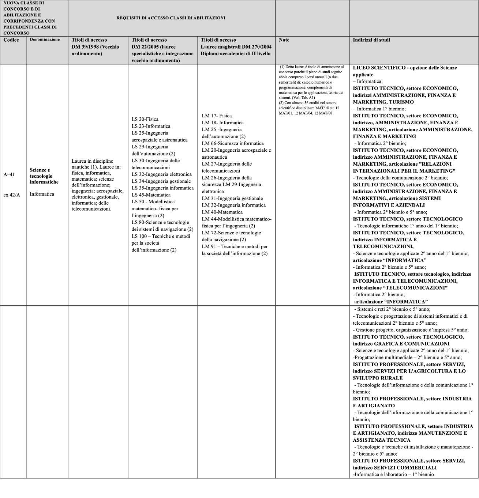
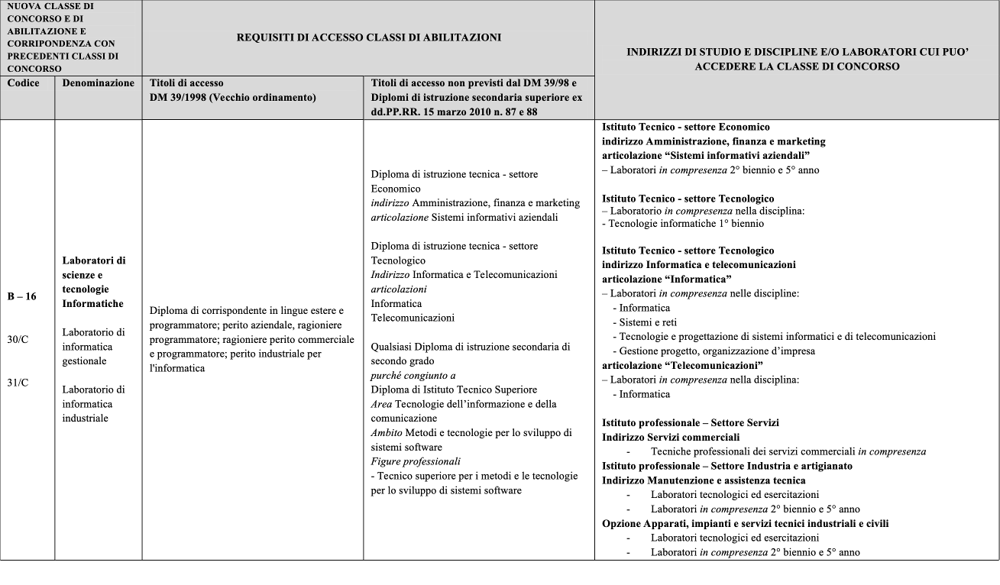
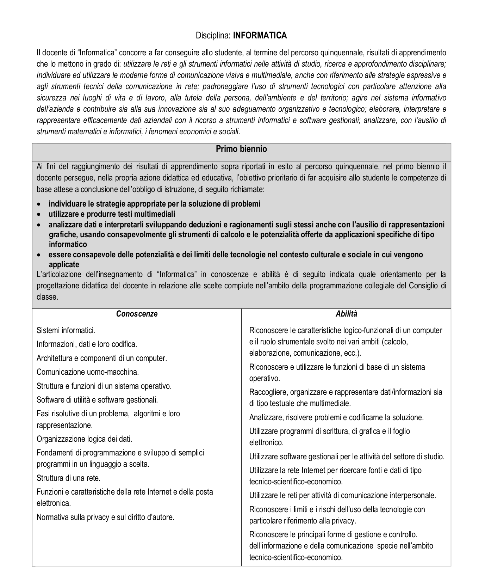
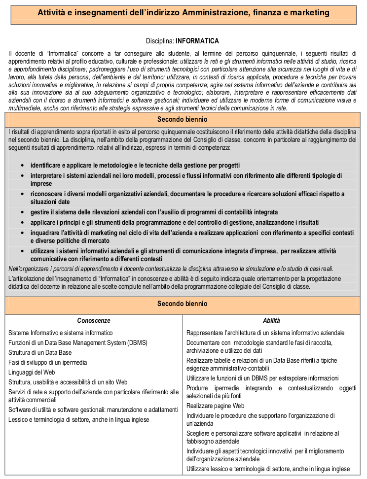
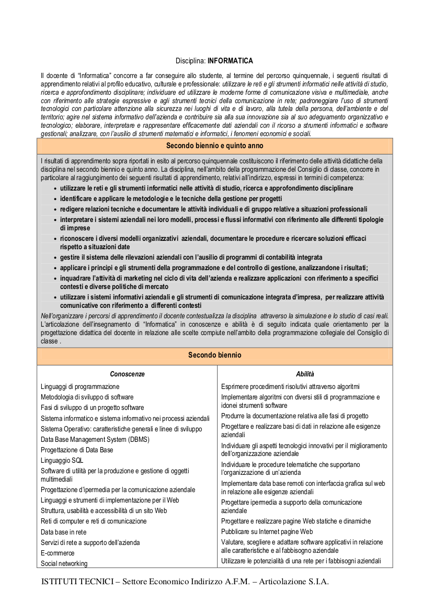
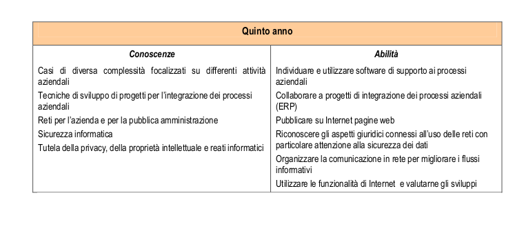
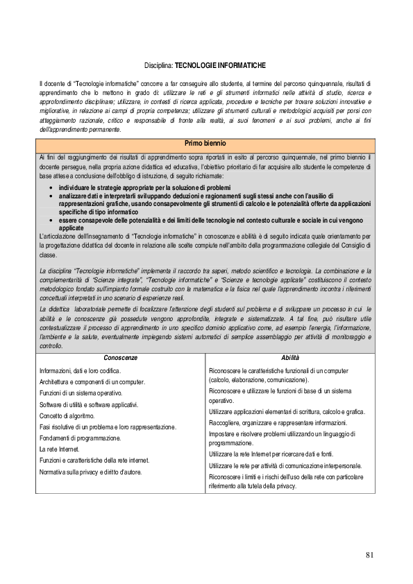
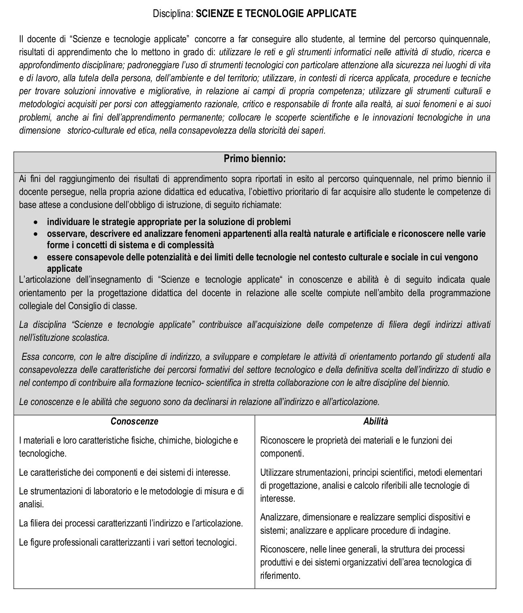

# Informatica nella scuola secondaria di secondo grado

Ad esclusione delle supplenze, per insegnare è necessario essere abilitati in una certa classe di concorso (identificata di solito con una lettera e un numero, es. A-41, B-16...).

## Cosa si può insegnare (e cosa no) con una Laurea Magistrale in Informatica (LM-18)

* A-41 Scienze e tecnologie informatiche
* A-47 Scienze matematiche applicate
* A-26 Matematica (Con almeno 60 CFU SSD MAT)
* A-28 Matematica e scienze (nella Scuola Secondaria di Primo Grado) (Con almeno 84 CFU SSD MAT, FIS, CHIM, GEO, BIO, INF/01, ING- INF/05, SECS-S/01 di cui almeno 24 CFU in MAT e 24 CFU complessivi tra FIS, BIO, CHIM e GEO)
* A-40 Scienze e tecnologie elettriche ed elettroniche (Con almeno 48 CFU ING-IND e ING-INF di cui 12 ING-IND/31, 12 ING-IND/32 12 ING-IND/33, 12 ING-INF/07)

La LM-18 *non* dà accesso alla classe A-60 "Tecnologia nella scuola secondaria di primo grado".

La LM-18 *non* dà accesso all'insegnaemnto di A-27 (Matematica e Fisica), possibile invece per i laureati di *Ingegneria Informatica* con vincoli sui CFU.

La classe A-66 "Trattamento testi, dati ed applicazioni. Informatica." ex dattilografia-stenografia, alla quale si accedeva con un diploma di
ragioneria o simili (fortunatamente ad esaurimento) consente l'insegnamento di:

* Tecnologie dell'informazione e della comunicazione negli istituti prof. rurale, industriale/artigianato
* Informatica e Laboratorio negli istituti professionali per Serivizi commerciali
* Informatica nel primo biennio degli istituti tecnici economici

## Chi può accedere alla classe A-41 e quali materie in quali indirizzi può insegnare

**NB**: *ci sono nuovi indirizzi professionali post riforma del 2017 (vedi più sotto) in cui gli A-41 possono insegnare materie quali TIC e Informatica.*

## Chi può accedere alla classe B-16 e quali materie in quali indirizzi può insegnare

## Licei

**[Indicazioni Nazionali vigenti](https://www.istruzione.it/alternanza/allegati/NORMATIVA%20ASL/INDICAZIONI%20NAZIONALI%20PER%20I%20LICEI.pdf)**

**[Proposta di Nuove Indicazioni Nazionali licei 2026](https://www.mim.gov.it/-/pubblicato-il-testo-delle-nuove-indicazioni-nazionali-per-i-licei-)**

### Tutti i licei (fino al 2026)

#### Primo biennio, nella disciplina Matematica

NB: la disciplina matematica può essere insegnata da A-26 e A-27, non da A-41.

> Elementi di informatica
> 
> Lo studente diverrà familiare con gli strumenti informatici, al fine precipuo di rappresentare e manipolare oggetti matematici e studierà le modalità di rappresentazione dei dati elementari testuali e multimediali.  Un tema fondamentale di studio sarà il concetto di algoritmo e l’elaborazione di strategie di risoluzioni algoritmiche nel caso di problemi semplici e di facile modellizzazione; e, inoltre, il concetto di funzione calcolabile e di calcolabilità e alcuni semplici esempi relativi

### PROPOSTA 2026: Tutti i licei tranne il LSA (proposta di Nuove Indicazioni 2026)

#### Informatica come ambito della matematica, primo biennio

Il nuovo testo proposto, con micro varianti [esplicitate qui](collazione.md)
, recita al momento più o meno così: 

> A partire da semplici esempi di algoritmi, anche incontrati nell’ambito degli altri nuclei, implementati con un opportuno linguaggio di programmazione, lo studente rafforza la sua abilità:
> 
> * analizzare un algoritmo o un programma per capirne il comportamento, identificarne eventuali difetti e correggerli;
> 
> * scrivere semplici programmi con strutture di controllo e condizioni, anche utilizzando variabili;
> 
> * valutare l’esito di un algoritmo o di un programma seguendone i passi e tenendo traccia del valore delle variabili.
> 
> Su questa base, con riferimento ad esempi significativi e in situazioni semplici, quali, ad esempio, la ricerca e l'ordinamento per una sequenza di numeri o di parole,sviluppa e approfondisce
> 
> * i concetti di esecuzione automatica di algoritmi, correttezza ed efficienza di algoritmi e programmi, rappresentazione dello stato di un programma informatico in esecuzione;
> 
> *  riconosce le relazioni tra le modalità di rappresentazione dei dati e l’efficacia della loro elaborazione attraverso algoritmi e programmiinformatici.
> 
> Inoltre, comprende l'importanza del punto di vista dell’utente (bisogni, competenze, contesto d'uso) nella definizione e realizzazione di soluzioni informatiche e acquisisce consapevolezza del legame tra le modalità con cui i problemi vengono risolti attraverso strumenti informatici e le conseguenze che tali soluzioni producono sul piano sociale, culturale ed etico anche nel caso di sistemi basati su tecniche dell’intelligenza artificiale.

#### PROPOSTA 2026: Informatica e Intelligenza Artificiale in tutte le altre discipline

[Qui un riassunto dei pricipali elementi di Informatica ed AI nelle altre discipline](informatica_trasversale_licei2026.md)

### Liceo Scientifico, Articolazione: Scienze Applicate

| 2h settimanali per tutti e 5 gli anni. |
|------|

Appunti tratti dalle linee guida ministeriali.

Aree tematiche:

* AC: architettura degli elaboratori
* SO: sistemi operativi
* AL: Algoritmi e Linguaggi
* DE: Elaborazione di Documenti
* RC: Reti
* IS: Struttura di Internet e Servizi
* CS: Calcolo Numerico e simulazione
* BD: Basi di Dati

Primo Biennio:

* AC: hardware Software, codifica binaria ASCII Unicode, Macchina di Von Neumann, CPU, memoria, dischi, bus, periferiche
* SO: caratteristiche dei SO, processo, gestione memoria e file system
* DE: documento elettronico (!?!), padronanza con particolare enfasi su spreadsheet.
* IS: Struttura di Internet, uso efficace, ricerca informazioni, regole
* AL: Principi base, tipi di linguaggi, implementazione di un (!) algoritmo in pseudo-code o in un linguaggio

Secondo Biennio:

* DE: linguaggi di markup, formati non testuali, font tipografiche, progettazione web
* BD: modello relazionale, linguaggi di interrogazione e manipolazione
* AL: implementazione(!) di un linguaggio di programmazione, metodologie di programmazione, sintassi di un linguaggio orientato agli oggetti.

Quinto Anno:

* CS: Calcolo Numerico, principali algoritmi
* RC/IS: protocolli, struttura di Internet, servizi
* CS: semplici simulazioni (supporto alla ''ricerca scientifica'', connessi a quanto studiato in Fisica o Scienze)

### PROPOSTA 2026: Liceo Scientifico, Articolazione: Scienze Applicate  (proposta di Nuove Indicazioni 2026)

[Testo completo della proposta di Informatica per LSA](lsa_proposta.md)

Appunti sintetici tratti dalla proposta di nuove indicazioni.

Aree tematiche:

* AC: architettura dei calcolatori
* SO: sistemi operativi
* AL: algoritmi e linguaggi di programmazione
* RS: reti di computer e servizi su rete
* CS: calcolo numerico e simulazione
* BD: basi di dati
* IA: intelligenza artificiale

Impostazione generale:

* L’informatica è presentata come disciplina scientifica e tecnologica, non solo come uso di strumenti digitali.
* Obiettivo: comprendere concetti, metodi e linguaggi dell’informatica per partecipare in modo consapevole, critico, responsabile ed etico alla società digitale.
* Forte attenzione a:
  * elaborazione automatica dei dati;
  * rapporto fra teoria e pratica;
  * collegamenti con matematica, fisica, scienze e altre discipline;
  * limiti, rischi e conseguenze sociali/culturali delle tecnologie digitali;
  * sistemi basati su intelligenza artificiale.
* Lo studente deve saper scegliere e usare strumenti informatici adeguati, sviluppare programmi semplici ma non banali, valutare correttezza ed efficienza, comprendere computer e reti a livello logico-funzionale.

Primo Biennio:

* AC: organizzazione strutturale e funzionale del calcolatore; CPU, memoria, dischi, bus, periferiche; produzione di documenti elettronici comuni.
* AL: algoritmi e strutture dati elementari; rappresentazione di algoritmi in pseudo-codice; costrutti fondamentali dei linguaggi di programmazione; uso di un linguaggio testuale per implementare algoritmi.
* SO: concetto di sistema operativo; funzionalità di base; caratteristiche generali dei sistemi operativi comuni; processo come programma in esecuzione; gestione di base della memoria; file system.
* RS: struttura generale delle reti e di Internet; servizi di rete; uso consapevole, sicuro e rispettoso delle reti e delle tecnologie digitali, anche in collaborazione con altre discipline.

Secondo Biennio:

* AC: linguaggi di markup, XML, formati non testuali, grafica bitmap e vettoriale, formati di compressione, semplici applicazioni web-oriented.
* BD: introduzione al modello relazionale; linguaggi di interrogazione e manipolazione dei dati.
* AL: metodologie di programmazione e sviluppo di sistemi informatici; uso anche di linguaggi orientati agli oggetti; riflessione sull’impatto sociale del software.
* IA: funzioni di base dei sistemi di intelligenza artificiale, in particolare percezione e azione.
* IA: modalità realizzative dei sistemi di IA: algoritmi, logica, reti neurali ecc; attenzione alle fonti di distorsione/bias; concetti fondamentali dell’apprendimento automatico; uso del machine learning nei sistemi generativi; discussione critica dei sistemi automatizzati di decisione.

Quinto Anno:

* Percorsi di approfondimento scelti dal docente, possibilmente in raccordo con le altre discipline e con attenzione all’impatto sociale.
* RS: applicazioni e servizi basati su reti di computer; protocolli di rete.
* AL: algoritmi su grafi; algoritmi crittografici.
* BD: progettazione e realizzazione di basi di dati.
* IA: tecniche di apprendimento automatico.
* CS: algoritmi di calcolo numerico; simulazioni a supporto del calcolo scientifico.

Differenze macroscopiche rispetto alle indicazioni attuali:

* sparisce come area autonoma DE, cioè elaborazione di documenti, anche se resta nel primo biennio la produzione di documenti elettronici;
* RC/IS vengono sostanzialmente accorpate in RS: reti di computer e servizi su rete;
* compare esplicitamente IA come nuova area tematica;
* l’informatica è descritta più chiaramente come disciplina scientifica autonoma;
* aumenta l’enfasi su uso critico, responsabilità, impatto sociale, rischi, bias e sistemi automatizzati;
* il quinto anno diventa meno prescrittivo: non solo calcolo numerico/reti/simulazione, ma possibili percorsi di approfondimento anche su grafi, crittografia, basi di dati e apprendimento automatico.

## Tecnici

**[Linee guida primo biennio](http://www.gazzettaufficiale.it/eli/gu/2010/09/22/222/so/222/sg/pdf)** (in vigore per i tecnici, non più valide per i professionali)

**[Linee guida secondo biennio e quinto anno](http://www.gazzettaufficiale.it/eli/gu/2012/03/30/76/so/60/sg/pdf)**
(in vigore per i tecnici, non più valide per i professionali)

| Settore | Indirizzo | Articolazione | Insegnamento | I | II | III | IV | V |
|---|---|---|---|---:|---:|---:|---:|---:|
| Economico | Tutti | Tutte | Informatica | 2 | 2 |  |  |  |
| Economico | Amministrazione, finanza e marketing | Amministrazione, finanza e marketing | Informatica |  |  | 2 | 2 |  |
| Economico | Amministrazione, finanza e marketing | Sistemi informativi aziendali | Informatica |  |  | 4 | 5 | 5 |
| Economico | Amministrazione, finanza e marketing | Relazioni internazionali per il marketing | Tecnologie della comunicazione |  |  | 2 | 2 |  |
| Tecnologico | Tutti | Tutte | Tecnologie informatiche | 3 |  |  |  |  |
| Tecnologico | Tutti | Tutte | Scienze e tecnologie applicate |  | 3 |  |  |  |
| Tecnologico | Informatica e telecomunicazioni | Tutte | Sistemi e reti |  |  | 4 | 4 | 4 |
| Tecnologico | Informatica e telecomunicazioni | Tutte | Tecnologie e progettazione di sistemi |  |  | 3 | 3 | 4 |
| Tecnologico | Informatica e telecomunicazioni | Tutte | Gestione progetto, organizzazione d'impresa |  |  |  |  | 3 |
| Tecnologico | Informatica e telecomunicazioni | Informatica | Informatica |  |  | 6 | 6 | 6 |
| Tecnologico | Informatica e telecomunicazioni | Telecomunicazioni | Informatica |  |  | 3 | 3 |  |
| Tecnologico | Grafica e comunicazione | — | Progettazione multimediale |  |  | 4 | 3 | 4 |

## Tecnico settore Economico

### Tutti gli indirizzi

#### prima: Informatica (2h)
#### seconda: Informatica (2h)

### Indirizzo Amministrazione, Finanza, Marketing. (senza articolazione)

#### terza: Informatica (2h)
#### quarta: Informatica (2h)

### Indirizzo Amministrazione, Finanza, Marketing. Articolazione: Sistemi Informativi

#### terza: Informatica (4h)
#### quarta: Informatica (5h)
#### quinta: Informatica (5h)

### Indirizzo Amministrazione, Finanza, Marketing. Articolazione: Marketing e Relazione
#### terza: Tecnologie della Comunicazione (2h)
#### quarta: Tecnologie della Comunicazione (2h)

## Tecnico settore Tecnologico

### Tutti gli Indirizzi

#### prima: Tecnologie Informatiche (3h)

#### seconda: Scienze e Tecnologie Applicate (3h)

### Indirizzo Informatica e Telecomunicazioni. Articolazione: Informatica

[informatica telecomunicazioni: Linee guida](images/informatica_telecomunicazioni.pdf)

#### terza: Informatica (6h)
#### quarta: Informatica (6h)
#### quinta: Informatica (6h)

### Indirizzo Informatica e Telecomunicazioni. Articolazione: Telecomunicazioni

#### terza: Informatica (3h)
#### quarta: Informatica (3h)

### Indirizzo Informatica e Telecomunicazioni. Articolazioni: Informatica, Telecomunicazioni, 

#### seconda: Scienza e Tecnologia applicate (3h)

#### terza: Sistemi e Reti (4h)
#### quarta: Sistemi e Reti (4h)
#### quinta: Sistemi e Reti (4h)

#### terza: Tecnologie e progettazione di sistemi (3h)
#### quarta: Tecnologie e progettazione di sistemi (3h)
#### quinta: Tecnologie e progettazione di sistemi (4h)

#### quinta: Gestione  (4h)

### Indirizzo Grafica e Telecomunicazioni.

#### seconda: Scienza e Tecnologia applicate (3h)

## Tecnici dal 2026 (quadri orari già legge, mancano le linee guida e l'assegnazione alle classi di concorso)

NB: c'è una quota di orario a disposizione dell'autonomia della scuola.

| Settore | Indirizzo | Articolazione | Insegnamento | I | II | III | IV | V | Note |
|---|---|---|---|---:|---:|---:|---:|---:|---|
| Economico | Amministrazione, finanza e marketing | Tutte | Tecnologie dell'informazione e della comunicazione | 2 | 2 |  |  |  | Primo biennio comune |
| Economico | Amministrazione, finanza e marketing | Amministrazione, finanza e marketing | Informatica applicata |  |  | 2 | 2 |  | Triennio AFM ordinario |
| Economico | Amministrazione, finanza e marketing | Relazioni internazionali per il marketing | Informatica applicata |  |  | 2 | 2 |  | Sostituisce, nella denominazione, la precedente area “Tecnologie della comunicazione” |
| Economico | Amministrazione, finanza e marketing | Sistemi informativi aziendali | Informatica applicata |  |  | 4 | 5 | 3 | Nel V anno scende rispetto al pre-2026 |
| Economico | Turismo, beni culturali e ambientali | — | Tecnologie dell'informazione e della comunicazione | 2 | 2 |  |  |  | Primo biennio |
| Tecnologico-ambientale | Agraria, agroalimentare e agroindustria | Tutte | Informatica e smart farming | 3 |  |  |  |  | Primo biennio, area tecnologica di base |
| Tecnologico-ambientale | Chimica, materiali e biotecnologie | Tutte | Tecnologie dell'informazione e della comunicazione | 2 |  |  |  |  | Primo biennio |
| Tecnologico-ambientale | Costruzioni, ambiente e territorio | Tutte | Tecnologie dell'informazione e della comunicazione | 3 |  |  |  |  | Primo biennio |
| Tecnologico-ambientale | Elettronica ed elettrotecnica | Tutte | Tecnologie dell'informazione e della comunicazione | 3 |  |  |  |  | Primo biennio |
| Tecnologico-ambientale | Meccanica, meccatronica ed energia | Tutte | Tecnologie dell'informazione e della comunicazione | 3 |  |  |  |  | Primo biennio |
| Tecnologico-ambientale | Sistema moda | Tutte | Tecnologie dell'informazione e della comunicazione | 3 |  |  |  |  | Primo biennio |
| Tecnologico-ambientale | Trasporti e logistica | Tutte | Tecnologie dell'informazione e della comunicazione | 3 |  |  |  |  | Primo biennio |
| Tecnologico-ambientale | Informatica e telecomunicazioni | Tutte | Informatica e reti di comunicazione | 4 | 4 |  |  |  | Primo biennio specifico dell’indirizzo |
| Tecnologico-ambientale | Informatica e telecomunicazioni | Tutte | Sistemi e reti |  |  | 3 | 3 | 2 | Triennio, entrambe le articolazioni |
| Tecnologico-ambientale | Informatica e telecomunicazioni | Tutte | Tecnologie e progettazione di sistemi informatici e di telecomunicazioni |  |  | 2 | 2 | 2 | Triennio, entrambe le articolazioni |
| Tecnologico-ambientale | Informatica e telecomunicazioni | Informatica | Informatica |  |  | 6 | 6 | 5 | Articolazione Informatica |
| Tecnologico-ambientale | Informatica e telecomunicazioni | Informatica | Telecomunicazioni |  |  | 2 | 2 |  | Articolazione Informatica |
| Tecnologico-ambientale | Informatica e telecomunicazioni | Telecomunicazioni | Informatica |  |  | 2 | 2 |  | Articolazione Telecomunicazioni |
| Tecnologico-ambientale | Informatica e telecomunicazioni | Telecomunicazioni | Telecomunicazioni |  |  | 6 | 6 | 5 | Articolazione Telecomunicazioni |
| Tecnologico-ambientale | Grafica e comunicazione | — | Laboratorio di tecnologie digitali | 3 | 3 |  |  |  | Primo biennio |
| Tecnologico-ambientale | Grafica e comunicazione | — | Teoria e tecnica della comunicazione |  | 2 | 2 | 2 | 2 | Disciplina affine: comunicazione/digitale |
| Tecnologico-ambientale | Grafica e comunicazione | — | Progettazione multimediale |  |  | 4 | 4 | 2 | Triennio |
| Tecnologico-ambientale | Trasporti e logistica | Logistica | Tecnologie digitali e sistemi informativi della logistica |  |  | 3 | 3 |  | Solo articolazione Logistica |

## Professionali

La vecchia normativa comune Tecnici e Professionali non si applica più a decorrere dall’anno scolastico 2022/2023.

Attualmente [queste sono le linee guida vigenti (2019)](https://www.mim.gov.it/-/linee-guida-per-favorire-e-sostenere-l-adozione-del-nuovo-assetto-didattico-e-organizzativo-dei-percorsi-di-istruzione-professionale)

| Indirizzo | Insegnamento | Ore biennio | I-II sett. eq. | III | IV | V |
|---|---|---:|---:|---:|---:|---:|
| Agricoltura, sviluppo rurale, valorizzazione dei prodotti del territorio e gestione delle risorse forestali e montane | TIC | 132 | 2 |  |  |  |
| Pesca commerciale e produzioni ittiche | TIC | 132-165 | 2-2,5 |  |  |  |
| Industria e artigianato per il made in Italy | TIC | 132-165 | 2-2,5 |  |  |  |
| Manutenzione e assistenza tecnica | TIC | 132-165 | 2-2,5 |  |  |  |
| Manutenzione e assistenza tecnica | Tecnologie e tecniche di installazione, manutenzione e diagnostica |  |  | 4-5 | 4-5 | 5-6 |
| Gestione delle acque e risanamento ambientale | TIC | 132 | 2 |  |  |  |
| Servizi commerciali | TIC | 132-198 | 2-3 |  |  |  |
| Servizi commerciali | Informatica |  |  | 0-3 | 0-3 | 0-3 |
| Enogastronomia e ospitalità alberghiera | TIC | 99-132 | 1,5-2 |  |  |  |
| Servizi culturali e dello spettacolo | TIC | 132 | 2 |  |  |  |
| Servizi per la sanità e l’assistenza sociale | TIC | 132-165 | 2-2,5 |  |  |  |
| Arti ausiliarie delle professioni sanitarie: odontotecnico | TIC | 132 | 2 |  |  |  |
| Arti ausiliarie delle professioni sanitarie: ottico | TIC | 132 | 2 |  |  |  |

Pur esistendo ancora materie e quadri orari, l'approccio didattico è fortemente basato sulla personalizzazione (Progetto Formativo Individuale) e sulle Unità di Apprendimento (UdA).

I professionali attuali godono di una quota di autonomia e flessibilità altissima (il 20% nel biennio e il 20% nel triennio). Il decreto fornisce il monte ore per l'area di istruzione generale e per l'area di indirizzo, ma le singole scuole declinano le materie in base al Progetto Formativo Individuale (PFI) e alle esigenze del territorio in modo molto più fluido rispetto a licei e tecnici.

La riforma ha imposto un cambio di paradigma radicale: si è passati da una didattica "per programmi e per materie" a una didattica "per competenze e per Assi Culturali".

Nei documenti attuali il Ministero non dice più esattamente cosa insegnare nella singola disciplina (es. non c'è la tabella per "TIC" o "Informatica"), ma fissa dei traguardi più ampi:

* Risultati di apprendimento intermedi (alla fine del biennio) e finali (alla fine del quinto anno).
* Questi risultati non sono associati alla singola materia, ma agli Assi Culturali (Asse dei linguaggi, Asse matematico, Asse storico-sociale) per l'area generale, e alle Competenze di Indirizzo per l'area di specializzazione.

I Dipartimenti Disciplinari e i Consigli di Classe di ogni singola scuola, avvalendosi dell'ampia autonomia concessa (20% del monte ore), hanno il compito di "spacchettare" quelle competenze e definire quali Conoscenze (i contenuti teorici) e quali Abilità (il saper fare) servono per raggiungerle nel loro specifico contesto territoriale.

Nella pratica, scuole e libri di testo spesso fanno ancora riferimento alle vecchie [linee guida per i tecnici e profesisonali](#tecnici).

### Informatica e TIC negli istituti professionali - un riassunto di un LLM

#### Fonte: [Linee guida 2019](https://www.mim.gov.it/-/linee-guida-per-favorire-e-sostenere-l-adozione-del-nuovo-assetto-didattico-e-organizzativo-dei-percorsi-di-istruzione-professionale)

- `[LG 2019]` = Linee guida per favorire e sostenere l’adozione del nuovo assetto didattico e organizzativo dei percorsi di istruzione professionale.
- `[All. A]` = Allegato A: risultati di apprendimento intermedi del profilo di uscita dei percorsi di istruzione professionale per le attività e gli insegnamenti di area generale.
- `[All. B]` = Allegato B: risultati di apprendimento intermedi dell’area generale riferiti ai livelli QNQ e agli assi culturali.
- `[All. C-a]` = Agricoltura, sviluppo rurale, valorizzazione dei prodotti del territorio, gestione delle risorse forestali e montane.
- `[All. C-b]` = Pesca commerciale e produzioni ittiche.
- `[All. C-c]` = Industria e artigianato per il Made in Italy.
- `[All. C-d]` = Manutenzione e assistenza tecnica.
- `[All. C-e]` = Gestione delle acque e risanamento ambientale.
- `[All. C-f]` = Servizi commerciali.
- `[All. C-g]` = Enogastronomia e ospitalità alberghiera.
- `[All. C-h]` = Servizi culturali e dello spettacolo.
- `[All. C-i]` = Servizi per la sanità e l’assistenza sociale.
- `[All. C-l]` = Arti ausiliarie delle professioni sanitarie: odontotecnico.
- `[All. C-m]` = Arti ausiliarie delle professioni sanitarie: ottico.

#### Quadro generale

| Ambito | Riferimento | Espressioni tecniche presenti nei documenti | Sintesi |
|---|---|---|---|
| Scenario generale | “trasformazione digitale (rivoluzione industriale 4.0)”; “diffusione pervasiva delle tecnologie digitali” `[LG 2019]` | “tecnologie digitali”; “trasformazione digitale”; “rivoluzione industriale 4.0” `[LG 2019]` | Le Linee guida collocano l’istruzione professionale nel contesto delle trasformazioni tecnologiche e digitali del lavoro. `[LG 2019]` |
| TIC | “TIC”; “Le moderne tecnologie della comunicazione”; “metodologie per il trattamento massivo di dati”; “capacità di elaborazione e archiviazione” `[LG 2019]` | “tecnologie dell’informatica e della comunicazione”; “interfacce visuali”; “reti veloci, mobili, economiche e ovunque accessibili”; “insegnamento delle TIC” `[LG 2019]` | Le TIC sono presentate come ambito da trattare in rapporto all’area di indirizzo e a situazioni reali connesse all’area professionalizzante. `[LG 2019]` |
| TIC e indirizzi | “programmazione per l’Indirizzo Manutenzione e assistenza tecnica”; “CAD per l’indirizzo Industria e artigianato per il made in Italy”; “automazione di ufficio per l’indirizzo Servizi commerciali” `[LG 2019]` | “programmazione”; “CAD”; “automazione di ufficio” `[LG 2019]` | Le Linee guida indicano esempi di contenuti specifici da sviluppare in funzione degli indirizzi. `[LG 2019]` |
| Area generale: comunicazione | “fonti diverse, anche digitali”; “adeguati supporti multimediali”; “risorse multimodali” `[All. B]` | “digitali”; “supporti multimediali”; “risorse multimodali” `[All. B]` | Le competenze linguistiche includono fonti digitali, supporti multimediali e risorse multimodali. `[All. B]` |
| Area generale: comunicazione visiva e multimediale | “Individuare e utilizzare le moderne forme di comunicazione visiva e multimediale, anche con riferimento alle strategie espressive e agli strumenti tecnici della comunicazione in rete” `[All. B]` | “comunicazione visiva e multimediale”; “strumenti tecnici della comunicazione in rete”; “testi multimediali” `[All. B]` | La comunicazione multimediale e in rete è una competenza generale trasversale. `[All. B]` |
| Area generale: reti e strumenti informatici | “Utilizzare le reti e gli strumenti informatici nelle attività di studio, ricerca e approfondimento” `[All. B]` | “reti”; “strumenti informatici”; “dispositivi individuali”; “servizi di rete”; “sicurezza e privacy” `[All. A]` | L’uso di reti e strumenti informatici è previsto come competenza generale per studio, ricerca, approfondimento e lavoro. `[All. A] [All. B]` |
| Area generale: matematica e strumenti informatici | “risolvere problemi strutturati anche utilizzando strumenti e applicazioni informatiche”; “strumenti e applicazioni informatiche avanzate” `[All. B]` | “strumenti e applicazioni informatiche”; “strumenti e applicazioni informatiche avanzate” `[All. B]` | Gli strumenti informatici sono richiamati anche nell’asse matematico per la risoluzione di problemi. `[All. B]` |

#### Riferimenti per indirizzo

| Indirizzo | Riferimento | Espressioni tecniche presenti nei documenti | Sintesi |
|---|---|---|---|
| Agricoltura, sviluppo rurale, valorizzazione dei prodotti del territorio, gestione delle risorse forestali e montane | “Descrivere e rappresentare le caratteristiche ambientali e agro produttive di un territorio, anche attraverso l’utilizzo e la realizzazione di mappe tematiche e di sistemi informativi computerizzati” `[All. C-a]` | “mappe tematiche”; “sistemi informativi computerizzati”; “sistemi informativi geografici”; “data base”; “sistema GIS”; “Web GIS”; “strumentazione di settore anche di tipo informatico” `[All. C-a]` | L’informatica compare soprattutto nella rappresentazione del territorio, nei sistemi informativi geografici e nella gestione di dati territoriali. `[All. C-a]` |
| Pesca commerciale e produzioni ittiche | “Tecnologie e strumenti informatici dedicati alla pesca”; “Ausili e sistemi tecnologici ed informatici per il controllo dei dati”; “utilizzare adeguatamente gli strumenti informatici e i software dedicati agli aspetti produttivi, gestionali e commerciali” `[All. C-b]` | “Navigazione elettronica e satellitare”; “carte elettroniche”; “formato digitale”; “Software di settore”; “tecnologie digitali”; “Hardware e software di base e applicativi”; “internet e dei media” `[All. C-b]` | Il digitale è collegato a navigazione, pesca, controllo dei dati, documentazione tecnica, tracciabilità e gestione di microfiliere. `[All. C-b]` |
| Industria e artigianato per il Made in Italy | “Realizzare disegni tecnici e/o artistici, utilizzando le metodologie di rappresentazione grafica e gli strumenti tradizionali o informatici” `[All. C-c]` | “strumenti di ricerca informatici”; “CAD”; “Principi di programmazione di sistemi CAD”; “modellazione 3D”; “software dedicati al disegno”; “modelli fisici e/o virtuali”; “software CAD”; “macchine anche programmabili”; “CAM”; “CAD-CAM”; “Computer Aided Manufactoring”; “strumenti/canali digitali” `[All. C-c]` | L’informatica è legata a progettazione, disegno tecnico, CAD, modellazione 3D, CAM, prototipazione virtuale e strumenti digitali per la comunicazione e il monitoraggio. `[All. C-c]` |
| Manutenzione e assistenza tecnica | “Installare apparati e impianti, anche programmabili”; “Eseguire [...] attività di assistenza tecnica nonché di manutenzione ordinaria e straordinaria, degli apparati, degli impianti, anche programmabili” `[All. C-d]` | “logica programmabile”; “Strumenti e software di base per la diagnostica”; “tecnologie informatiche (CAD, word processor, fogli elettronici e data base, motori di ricerca in internet)”; “strumenti di misura, controllo e diagnosi (anche digitali)”; “supporti informatici”; “Software di utilità e software applicativi” `[All. C-d]` | L’informatica compare in impianti programmabili, diagnostica, CAD, software applicativi, basi di dati e supporti informatici per grafici, tabelle e documentazione. `[All. C-d]` |
| Gestione delle acque e risanamento ambientale | “Intervenire [...] avvalendosi anche delle tecnologie dell’informazione e della comunicazione” `[All. C-e]` | “strumenti informatici”; “tecnologie dell’informazione e della comunicazione”; “strumenti informatici e pannelli di controllo”; “Principi di telecontrollo”; “Tecniche di monitoraggio e telecontrollo”; “modelli di propagazione anche con l’ausilio di strumenti informatici” `[All. C-e]` | Le TIC sono connesse a gestione ambientale, controllo di reti e impianti, telecontrollo, monitoraggio e uso di modelli. `[All. C-e]` |
| Servizi commerciali | “Curare l’applicazione, l’adattamento e l’implementazione dei sistemi informativi aziendali, contribuendo a semplici personalizzazioni degli applicativi informatici e degli spazi di archiviazione aziendale” `[All. C-f]` | “sistema informativo aziendale”; “sistemi informativi aziendali”; “strumenti informatici”; “software di base”; “tecnologie informatiche di base”; “sistema operativo”; “internet”; “posta elettronica”; “software applicativi”; “pagine web”; “Linguaggi di base del WEB”; “Web semantico”; “Linguaggi di Markup”; “reti di computer”; “protocolli di rete”; “linguaggi informatici”; “web marketing”; “social media”; “social network” `[All. C-f]` | È l’indirizzo con il riferimento più esplicito a sistemi informativi, applicativi, web, reti, protocolli, privacy, archiviazione e gestione digitale dei processi aziendali. `[All. C-f]` |
| Enogastronomia e ospitalità alberghiera | “Utilizzare i principali software applicativi”; “Progettare, anche con tecnologie digitali, eventi enogastronomici e culturali”; “utilizzando il web” `[All. C-g]` | “software applicativi”; “Software applicativi di base”; “Software applicativi di settore”; “comunicazione verbale e digitale”; “tecnologie digitali”; “Servizi internet”; “Strumenti digitali”; “web”; “Software applicativi e internet”; “marketing turistico e web marketing”; “software gestionali”; “social media” `[All. C-g]` | Il digitale è usato per organizzazione, marketing, promozione, offerta turistica, comunicazione e gestione dei servizi. `[All. C-g]` |
| Servizi culturali e dello spettacolo | “Realizzare prodotti visivi, audiovisivi e sonori”; “prodotti analogici e digitali”; “web”; “new media” `[All. C-h]` | “supporti analogici e digitali”; “software di ideazione, videoscrittura, presentazione”; “presentazione multimediale”; “web”; “Software di videoscrittura, presentazione multimediale, mind mapping, sceneggiatura”; “new media”; “hardware e software”; “computer graphic”; “animazione 2D e 3D”; “virtual set”; “streaming web radio e web tv”; “codifica e trascrizione dei dati digitali”; “data management”; “transcodifica”; “editing”; “post-produzione”; “ftp”; “html”; “live streaming”; “VFX”; “crossmediale” `[All. C-h]` | È l’indirizzo più ricco di lessico digitale specialistico: produzione audiovisiva, web, new media, post-produzione, archiviazione, trasmissione, streaming e gestione di dati digitali. `[All. C-h]` |
| Servizi per la sanità e l’assistenza sociale | “Utilizzare i supporti informatici applicati al lavoro in ambito sociale, socio-sanitario e socio-educativo”; “Utilizzare sistemi informatici per la gestione amministrativa e contabile” `[All. C-i]` | “supporti informatici”; “sistemi informatici”; “fogli di calcolo”; “comunicazione multimediale e dei social”; “social media”; “applicativi web based e offline”; “hardware”; “software”; “Siti web e social network”; “Servizi internet”; “raccolta e archiviazione dati”; “sistemi di protezione e trasmissione dati”; “Uso del web nei servizi, telemedicina” `[All. C-i]` | L’informatica è collegata a documentazione, servizi territoriali, gestione amministrativa, raccolta dati, comunicazione multimediale, social media e telemedicina. `[All. C-i]` |
| Arti ausiliarie delle professioni sanitarie: odontotecnico | “Utilizzare macchine a controllo numerico (cad-cam) per la realizzazione di dispositivi protesici”; “Gestire autonomamente la lavorazione CAD/CAM” `[All. C-l]` | “ambito digitale”; “macchine a controllo numerico (cad-cam)”; “Software dedicati”; “protesi digitali”; “procedure cad-cam”; “CAD/CAM”; “strumenti informatici”; “software semplici”; “cad”; “software specifici”; “apparecchiature a controllo numerico” `[All. C-l]` | Il digitale è parte delle lavorazioni odontotecniche: CAD/CAM, software di modellazione e rappresentazione, macchine e apparecchiature a controllo numerico. `[All. C-l]` |
| Arti ausiliarie delle professioni sanitarie: ottico | “Utilizzare le applicazioni software per la gestione e promozione del prodotto”; “Utilizzare specifici software di acquisizione e simulazione” `[All. C-m]` | “Software gestionale”; “applicazioni software”; “presentazioni multimediali”; “Software per la creazione di presentazioni multimediali”; “software gestionale specifico”; “software di acquisizione e simulazione”; “software utilizzato in contattologia”; “software adeguato” `[All. C-m]` | L’informatica è collegata alla gestione commerciale, alla promozione, alle presentazioni multimediali e alla simulazione/acquisizione in ambito ottico e contattologico. `[All. C-m]` |