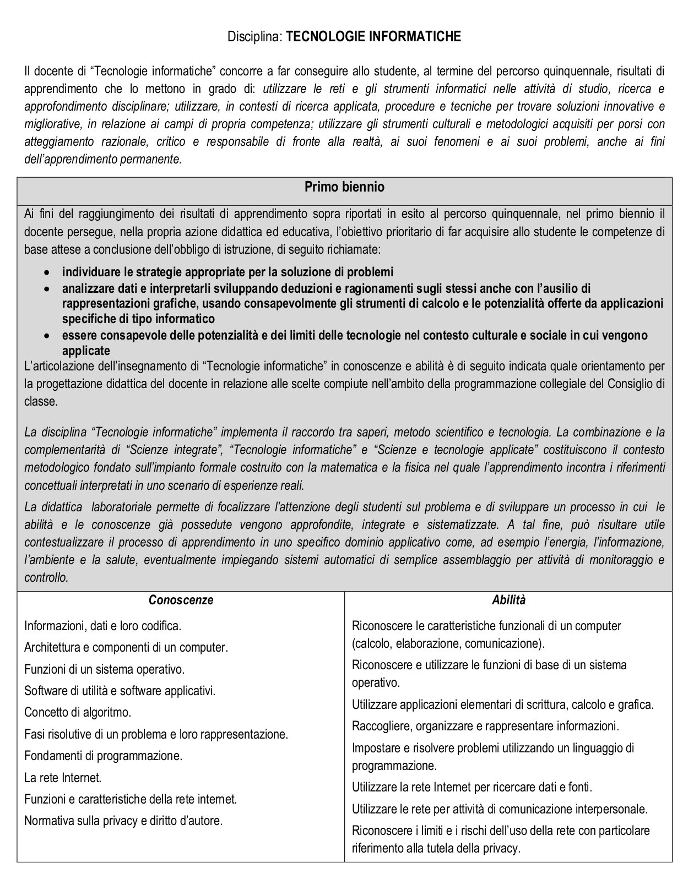
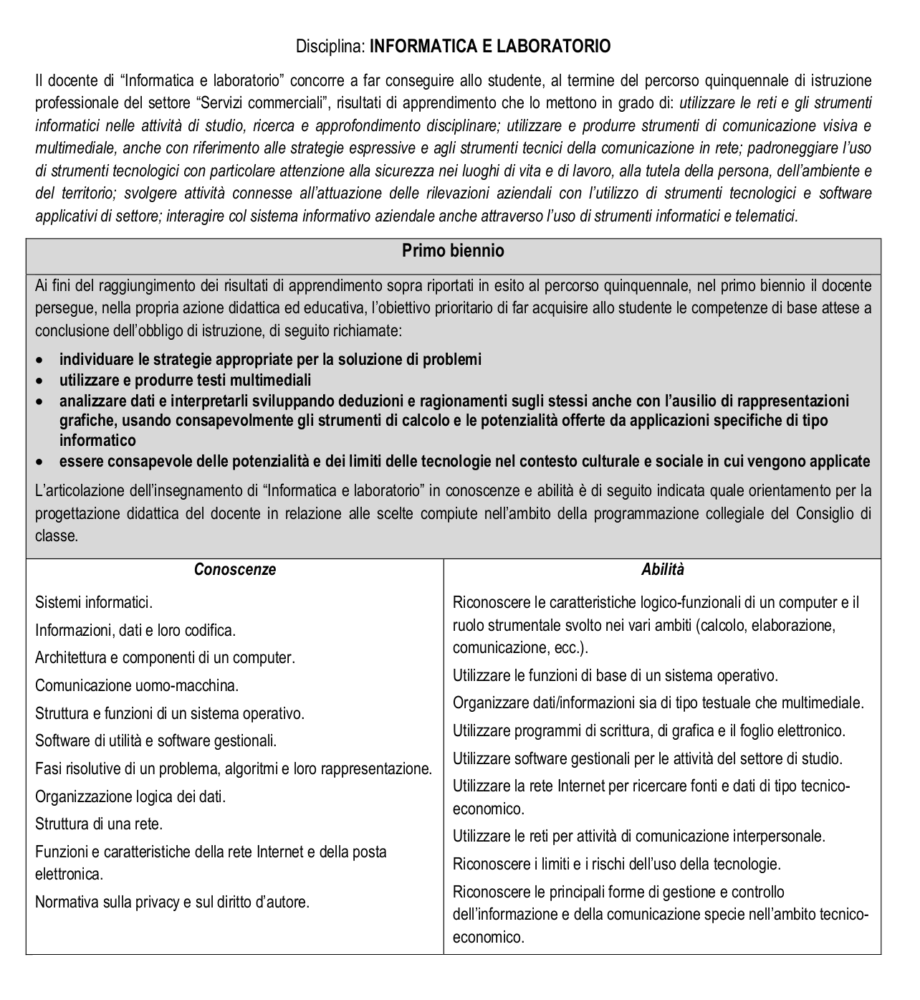
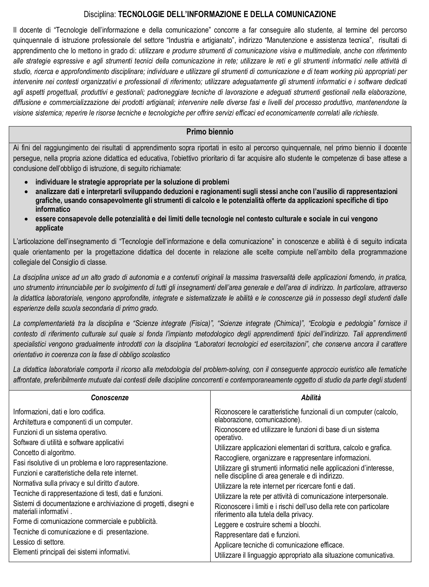

#Riflessioni sui *Programmi*

Questa pagina contiene una (parziale) riflessione sui contenuti da svolgere nelle varie scuole e negli anni di corso.
##Tabella A-41

##Liceo Scientifico

###Articolazione: Scienze Applicate

Appunti tratti dalle linee guida ministeriali.

Aree tematiche:

* AC: architettura degli elaboratori
* SO: sistemi operativi
* AL: Algoritmi e Linguaggi
* DE: Elaborazione di Documenti
* RC: Reti
* IS: Struttura di Internet e Servizi
* CS: Calcolo Numerico e simulazione
* BD: Basi di Dati

Primo Biennio:

* AC: hardware Software, codifica binaria ASCII Unicode, Macchina di Von Neumann, CPU, memoria, dischi, bus, periferiche
* SO: caratteristiche dei SO, processo, gestione memoria e file system
* DE: documento elettronico (!?!), padronanza con particolare enfasi su spreadsheet.
* IS: Struttura di Internet, uso efficace, ricerca informazioni, regole
* AL: Principi base, tipi di linguaggi, implementazione di un (!) algoritmo in pseudo-code o in un linguaggio

Secondo Biennio:

* DE: linguaggi di markup, formati non testuali, font tipografiche, progettazione web
* BD: modello relazionale, linguaggi di interrogazione e manipolazione
* AL: implementazione(!) di un linguaggio di programmazione, metodologie di programmazione, sintassi di un linguaggio orientato agli oggetti.

Quinto Anno:

* CS: Calcolo Numerico, principali algoritmi
* RC/IS: protocolli, struttura di Internet, servizi
* CS: semplici simulazioni (supporto alla ''ricerca scientifica'', connessi a quanto studiato in Fisica o Scienze)

 
####primo biennio (2h)

Argomenti irrinunciabili:

* [Concetti fondamentali dell'Informatica](concetti_fondamentali.md)
* Idea intuitiva di linguaggio/algoritmo
* Pseudo codice e diagrammi di flusso
* Codifica. Elaborazione Analogica e Digitale.
* Sistemi di Numerazione (in collegamento con Matematica)
* Algebra di Boole (collegato a insiemistica in Matematica)
* Elementi di architettura. Visioni ampie.
* Algoritmi di Ordinamento e Ricerca

Argomenti importanti:

* Rappresentazione degli interi. Complementazione.
* (M) ASCII-Unicode.
* Rete di Reti: internet e Internet. Client Server/Peer-to-Peer
* Internet non e' il Web: servizi e-mail voip chat

Argomenti ulteriori richiesti dal ministero

* Foglio Elettronico, concetto di cella e formula

####secondo biennio (2h)

####quinta (2h)

##Tecnico settore Economico

###Tutti gli indirizzi

####prima: Informatica (2h)
####seconda: Informatica (2h)

###Indirizzo Amministrazione, Finanza, Marketing. (senza articolazione)

####terza: Informatica (2h)
####quarta: Informatica (2h)

###Indirizzo Amministrazione, Finanza, Marketing. Articolazione: Sistemi Informativi

####terza: Informatica (4h)
####quarta: Informatica (5h)
####quinta: Informatica (5h)

###Indirizzo Amministrazione, Finanza, Marketing. Articolazione: Marketing e Relazione
####terza: Tecnologie della Comunicazione (2h)
####quarta: Tecnologie della Comunicazione (2h)

##Tecnico settore Tecnologico

###Tutti gli Indirizzi

####prima: Tecnologia Informatica (3h)

###Indirizzo Informatica e Telecomunicazioni. Articolazione: Informatica

[informatica telecomunicazioni: Linee guida](images/informatica_telecomunicazioni.pdf)

####terza: Informatica (6h)

*Informatica 6h:*

* Introduzione - Problema - informazione - algoritmo - Linguaggi di programmazione
* Fondamenti del linguaggio C/C++ - Struttura di un programma - Strutture di controllo
* Funzioni - Strutture e tabelle - Vettori mono-bidimensionali
* Ricorsione
* File di testo e binari
* HTML e CSS

*Sistemi 4h:*

* Fondamenti di networking e trasferimento dell'informazione
* ISO/OSI e TCP/IP
* Dispositivi per reti locali, apparati e sistemi per la connettività a Internet
* Tecniche di gestione dell'indirizzamento di rete: sottoreti, IPv4 e IPv6, netmask
* Protocolli per la comunicazione in rete e analisi degli strati : IP statici, dinamici, DHCP, ARP, NAT, ICMP

*Tecnologie 3h:*

* Codifica dell'informazione
* Classificazione, struttura e funzionamento generale dei sistemi operativi
* Sistemi operativi: kernel, gestione della memoria, File System

####quarta: Informatica (6h)

*Informatica 6h:*

* Strutture dati e approfondimenti C++ - classi
* Allocazione dinamica della memoria
* Albero binario di ricerca e overloading di funzioni
* Programmazione orientata agli oggetti - JAVA
* Ereditarietà e polimorfismo, interfacce
* Interfaccia grafica (awt e swing)
* Html e Javascript

*Sistemi 4h:*

* Struttura, architettura e componenti dei sistemi di elaborazione:
* Linguaggio Assembly
* Tecnologie informatiche per garantire la sicurezza e l’integrità dei dati e dei sistemi.

*Tecnologie 4h:*

* Sistemi operativi approfondimenti (storia)
* Politiche di gestione dei processi
* programmazione concorrente (thread)
* la sincronizzazione e accesso a risorse condivise (Semafori)

####Quinta: Informatica (6h)

In sintesi:

*Informatica 6h:*

* Sistemi informativi e sistemi informatici
* Le basi di dati relazionali
* Sistemi di gestione delle basi di dati e  linguaggio SQL
* Il linguaggio PHP per la programmazione lato server 

*Sistemi e Reti 4h:*

* Apparati di rete
* Tecniche crittografiche per la protezione dei dati
* La sicurezza delle reti 
* VLAN – Virtual Local Area Network
* Wireless e reti mobili

*Tecnologie e progettazione di sistemi informatici e di telecomunicazioni 4h:*

* Architettura di rete. 
* Socket e la comunicazione con i protocolli TCP/UDP.
* Applicazioni lato server

*Gestione progetto, organizzazione di impresa 3h:*

* Elementi di economia e organizzazione aziendale. 
* I processi aziendali.
* La Qualità
* Principi e tecniche del Project Management.
* Gestione di progetti informatici.

###Indirizzo Informatica e Telecomunicazioni. Articolazione: Telecomunicazioni

####terza: Informatica (3h)
####quarta: Informatica (3h)

###Indirizzo Informatica e Telecomunicazioni. Articolazioni: Informatica, Telecomunicazioni, 

####seconda: Scienza e Tecnologia applicate (3h)

####terza: Sistemi e Reti (4h)
####quarta: Sistemi e Reti (4h)
####quinta: Sistemi e Reti (4h)

####terza: Tecnologie e progettazione di sistemi (3h)
####quarta: Tecnologie e progettazione di sistemi (3h)
####quinta: Tecnologie e progettazione di sistemi (4h)

####quinta: Gestione  (4h)

###Indirizzo Grafica e Telecomunicazioni.

####seconda: Scienza e Tecnologia applicate (3h)

##Professionale

Provo a fare un ragionamento comune sul biennio dei professionali.
Il rischio per questi ragazzi e' di scivolare sulle nozioni a breve termine, noiose, inutili ma facili da preparare e da somministrare perche' meccaniche.

Andiamo con ordine e tentiamo di mettere informazioni a medio lungo termine sono solo idee sparse come indicazioni di massima per denozionalizzare i contenuti.

I principi fondamentali, quelli occorrono sempre.

Elementi principali dei sistemi informativi: Analogico vs Digitale. HW-SW, l'informatica non si fa solo con le macchine. Oggi gli elaboratori sono ovunque. (storia per ravvivare le lezioni, Turing, il garage di Jobs/Woz)
Informazione dati e loro codifica: tutto e' numero (codifica testo e giochi con codifica musica e immagini).
Architettura e componenti di un computer: smontare e rimontare un PC in aula (meglio se vecchiotto)

Funzioni di un Sistema Operativo: cosa e' il sistema operativo. vari sistemi operativi, real-time, sistemi di rete, cloud.

Software di utilita' e applicativi. Interfaccia grafica (e' bello raccontare X) e a linea comando. Tassonomia del software: strumenti di produttivita' personale, strumenti di amministrazione dei sistemi, strumenti per lo sviluppo di software. (e perche' no, strumenti ludici) 

Tecniche di rappresentazione dei testi, dati, funzioni. Non so cosa voglia dire il Ministero qui. Io inserirei le caratteristiche dei formati e.g. lossy/lossless.

Sistemi di documentazione e archiviazione progetti. Tecniche di presentazione.(?) 

CONCETTO DI ALGORITMO. Semplici diagrammi di flusso e alcuni esempi di semplici programmi.

Funzioni e caratteristiche di Internet. Internet e internet, internet non e' il web (mostrare tanti altri servizi di Internet). Idea di protocollo. (Storia di Internet per catturare l'attenzione)

Privacy e Diritto di Autore: LICENZE dei programmi e dei dati. Software libero e proprietario (storia del software libero).

Pianificazione e Marketing (???) 
 
###Settore Servizi. Indirizzo Agricoltura e sviluppo Rurale

####prima: Tecnologie dell'informazione e della comunicazione (2h)
####seconda: Tecnologie dell'informazione e della comunicazione (2h)

###Settore Servizi. Indirizzo Servizi Commerciali

####prima: Informatica e Laboratorio (2h)
####seconda: Informatica e Laboratorio (2h)

###Settore Industria e Artigianato. Tutti gli indirizzi

####prima: Tecnologie dell'informazione e della comunicazione (2h)
####seconda: Tecnologie dell'informazione e della comunicazione (2h)

###Settore Industria e Artigianato. Indirizzo: Manutenzione ed Assistenza Tecnica

####terza: Tecnologie e tecniche di installazione (3h)
####quarta: Tecnologie e tecniche di installazione (5h)
####quinta: Tecnologie e tecniche di installazione (8h)

