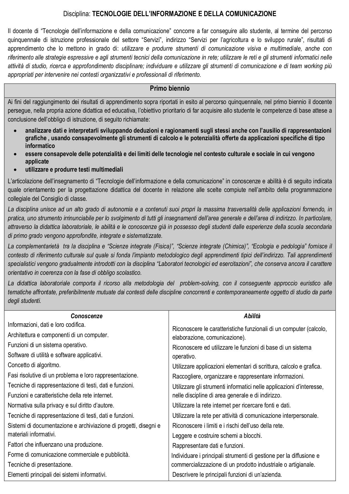
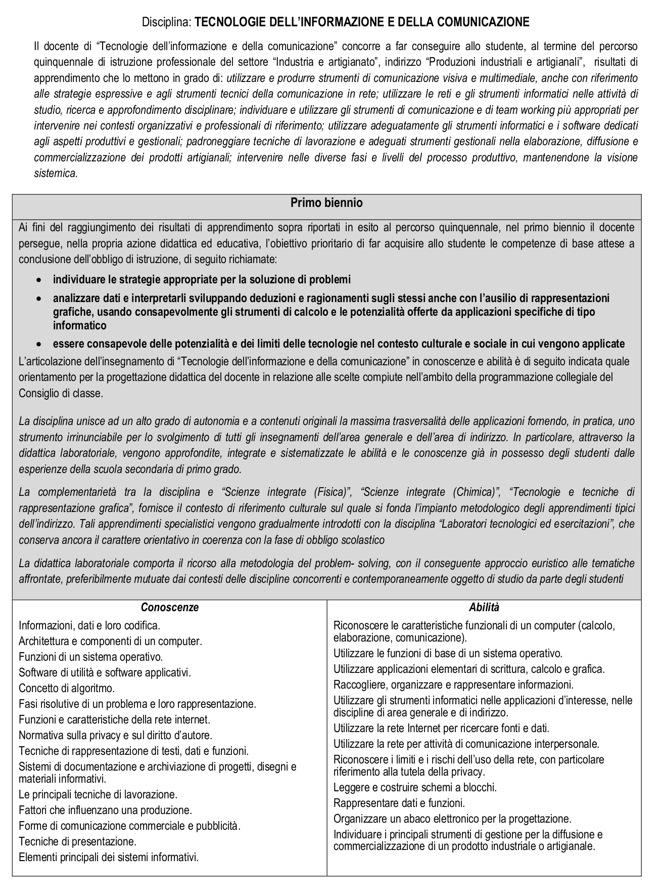

#Riflessioni sui *Programmi*

##Tabella A-41

Altre note dalla *Supplemento ordinario alla “Gazzetta Ufficiale„ n. 43 del 22 febbraio 2016*:

Con la laurea LM-18 Informatica si può accedere alle seguenti classi di concorsoi (oltre A-41):

* A-26 Matematica (a patto di avere 80 crediti MAT)
* A-40 Scienze e tecnologie elettriche e elettroniche (a patto di avere 12 crediti ING-INF e 36 ING-IND)
* A-47 Matematica applicata:
	* matematica a Liceo scientifico opzione scienze applicate
	* matematica a Tecnico economico
	* matematica a Proffessionale

La LM-18 *non* dà accesso alla classe A-60 "Tecnologia nella scuola secondaria di primo grado".

La classe A-66 "Trattamento testi" ex dattilografia-stenografia, alla quale si accedeva con un diploma di
ragioneria (fortunatamente ad esaurimento) consente l'insegnamento di:

* Tecnologie dell'informazione e della comunicazione negli istituti prof. rurale, industriale/artigianato
* Informatica e Laboratorio negli istituti professionali per Serivizi commerciali
* Informatica nel primo biennio degli istituti tecnici economici

##Informatica nelle scuole secondarie superiori

[Scuola secondaria di II grado in Italia](https://it.wikipedia.org/wiki/Scuola_secondaria_di_secondo_grado_in_Italia)

[Quadri orari delle scuole secondarie superiori](https://www.orientamentoistruzione.it/_file/documenti/QUADRI_ORARI/MIUR-%20Scuola%20Secondaria-superiore.pdf)

[Esami di Stato](https://www.istruzione.it/esame_di_stato/index.shtml)

##Licei

[Indicazioni Nazionali](https://www.istruzione.it/alternanza/allegati/NORMATIVA%20ASL/INDICAZIONI%20NAZIONALI%20PER%20I%20LICEI.pdf)

###Liceo Scientifico, Articolazione: Scienze Applicate

Appunti tratti dalle linee guida ministeriali.

Aree tematiche:

* AC: architettura degli elaboratori
* SO: sistemi operativi
* AL: Algoritmi e Linguaggi
* DE: Elaborazione di Documenti
* RC: Reti
* IS: Struttura di Internet e Servizi
* CS: Calcolo Numerico e simulazione
* BD: Basi di Dati

Primo Biennio:

* AC: hardware Software, codifica binaria ASCII Unicode, Macchina di Von Neumann, CPU, memoria, dischi, bus, periferiche
* SO: caratteristiche dei SO, processo, gestione memoria e file system
* DE: documento elettronico (!?!), padronanza con particolare enfasi su spreadsheet.
* IS: Struttura di Internet, uso efficace, ricerca informazioni, regole
* AL: Principi base, tipi di linguaggi, implementazione di un (!) algoritmo in pseudo-code o in un linguaggio

Secondo Biennio:

* DE: linguaggi di markup, formati non testuali, font tipografiche, progettazione web
* BD: modello relazionale, linguaggi di interrogazione e manipolazione
* AL: implementazione(!) di un linguaggio di programmazione, metodologie di programmazione, sintassi di un linguaggio orientato agli oggetti.

Quinto Anno:

* CS: Calcolo Numerico, principali algoritmi
* RC/IS: protocolli, struttura di Internet, servizi
* CS: semplici simulazioni (supporto alla ''ricerca scientifica'', connessi a quanto studiato in Fisica o Scienze)

 
####primo biennio (2h)
####secondo biennio (2h)
####quinta (2h)

###Tutti gli altri Licei:

####primo biennio, nel programma di Matematica, (2h?)
*Elementi di informatica*

*Lo studente diverrà familiare con gli strumenti informatici, al fine precipuo di rappresentare e manipolare oggetti matematici e studierà le modalità di rappresentazione dei dati elementari testuali e multimediali.  Un tema fondamentale di studio sarà il concetto di algoritmo e l’elaborazione di strategie di risoluzioni algoritmiche nel caso di problemi semplici e di facile modellizzazione; e, inoltre, il concetto di funzione calcolabile e di calcolabilità e alcuni semplici esempi relativi*

## Tecnici e Professionali
[Linee guida primo biennio](http://www.gazzettaufficiale.it/eli/gu/2010/09/22/222/so/222/sg/pdf)
[Linee guida secondo biennio e quinto anno](http://www.gazzettaufficiale.it/eli/gu/2012/03/30/76/so/60/sg/pdf)

##Tecnico settore Economico

###Tutti gli indirizzi

####prima: Informatica (2h)
####seconda: Informatica (2h)

###Indirizzo Amministrazione, Finanza, Marketing. (senza articolazione)

####terza: Informatica (2h)
####quarta: Informatica (2h)

###Indirizzo Amministrazione, Finanza, Marketing. Articolazione: Sistemi Informativi

####terza: Informatica (4h)
####quarta: Informatica (5h)
####quinta: Informatica (5h)

###Indirizzo Amministrazione, Finanza, Marketing. Articolazione: Marketing e Relazione
####terza: Tecnologie della Comunicazione (2h)
####quarta: Tecnologie della Comunicazione (2h)

##Tecnico settore Tecnologico

###Tutti gli Indirizzi

####prima: Tecnologie Informatiche (3h)

####seconda: Scienze e Tecnologie Applicate (3h)

###Indirizzo Informatica e Telecomunicazioni. Articolazione: Informatica

[informatica telecomunicazioni: Linee guida](images/informatica_telecomunicazioni.pdf)

####terza: Informatica (6h)
####quarta: Informatica (6h)
####Quinta: Informatica (6h)

###Indirizzo Informatica e Telecomunicazioni. Articolazione: Telecomunicazioni

####terza: Informatica (3h)
####quarta: Informatica (3h)

###Indirizzo Informatica e Telecomunicazioni. Articolazioni: Informatica, Telecomunicazioni, 

####seconda: Scienza e Tecnologia applicate (3h)

####terza: Sistemi e Reti (4h)
####quarta: Sistemi e Reti (4h)
####quinta: Sistemi e Reti (4h)

####terza: Tecnologie e progettazione di sistemi (3h)
####quarta: Tecnologie e progettazione di sistemi (3h)
####quinta: Tecnologie e progettazione di sistemi (4h)

####quinta: Gestione  (4h)

###Indirizzo Grafica e Telecomunicazioni.

####seconda: Scienza e Tecnologia applicate (3h)

##Professionale

###Settore Servizi. Indirizzo Agricoltura e sviluppo Rurale

####prima: Tecnologie dell'informazione e della comunicazione (2h)
####seconda: Tecnologie dell'informazione e della comunicazione (2h)

###Settore Servizi. Indirizzo Servizi Commerciali

####prima: Informatica e Laboratorio (2h)
####seconda: Informatica e Laboratorio (2h)

###Settore Industria e Artigianato. Tutti gli indirizzi

####prima: Tecnologie dell'informazione e della comunicazione (2h)
####seconda: Tecnologie dell'informazione e della comunicazione (2h)

###Settore Industria e Artigianato. Indirizzo: Manutenzione ed Assistenza Tecnica

####prima: Tecnologie dell'informazione e della comunicazione (2h)
####seconda: Tecnologie dell'informazione e della comunicazione (2h)

####terza: Tecnologie e tecniche di installazione (3h)
####quarta: Tecnologie e tecniche di installazione (5h)
####quinta: Tecnologie e tecniche di installazione (8h)

